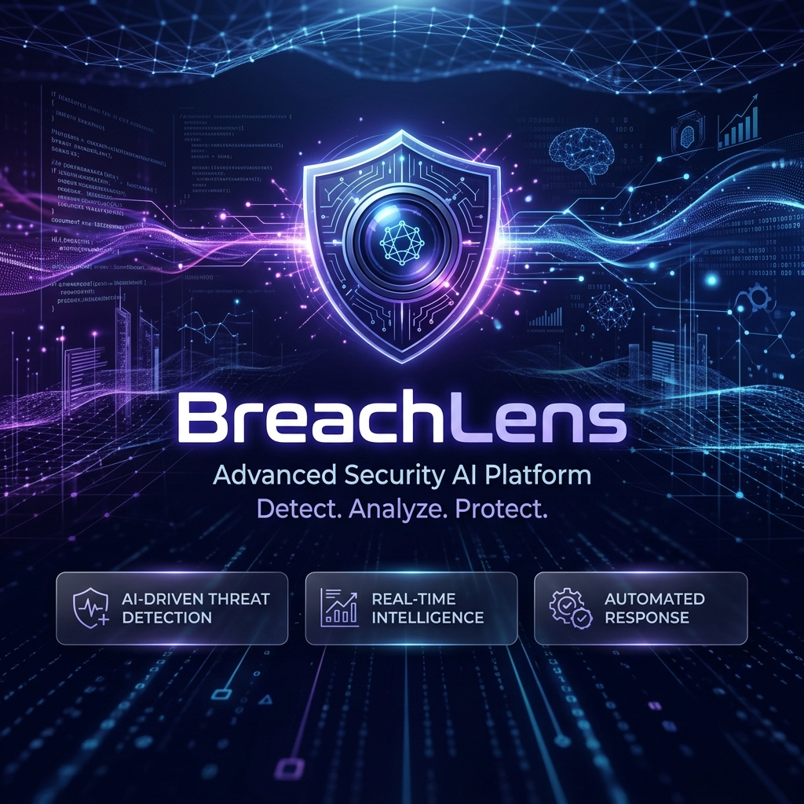
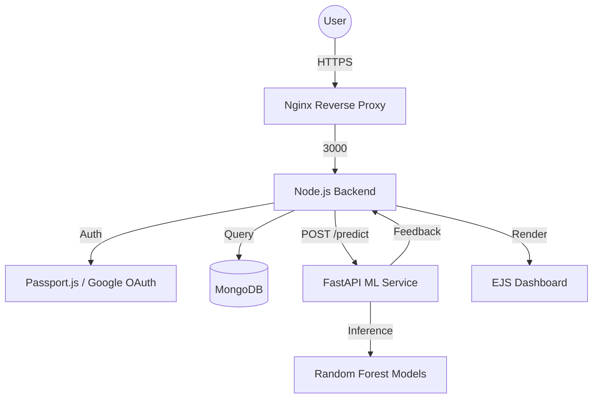

# <div align="center">🛡️ BreachLens AI Platform</div>

<div align="center">
  <h3>Advanced Data Breach Severity Prediction & Risk Analysis</h3>
  <p>A comprehensive end-to-end security solution leveraging Machine Learning to predict, analyze, and mitigate the impact of data breaches in real-time.</p>
</div>

---



## 📖 Overview
**BreachLens** is a sophisticated security intelligence platform designed for modern enterprises. It combines a robust Node.js/Express ecosystem with a high-performance FastAPI Machine Learning microservice. By analyzing historical breach data and current infrastructure metrics, BreachLens provides security teams with immediate, actionable insights into breach severity, financial exposure, and tactical remediation steps.

## 🚀 Key Features

### 🔐 Layered Authentication & Security
- **Hybrid Auth System**: Secure local authentication combined with Google OAuth 2.0.
- **Session Intelligence**: MongoDB-backed session persistence using `connect-mongo`.
- **Security Hardening**: Implementation of `helmet` for HTTP headers, `bcryptjs` for adaptive hashing, and global rate limiting.
- **Protected Environment**: Full JWT-ready middleware and session-based access control.

### 🧠 AI-Powered Prediction Engine
- **Multi-Model Intelligence**: Utilizes Random Forest classifiers and regressors for high-precision severity and financial impact prediction.
- **Feature-Rich Analysis**: Evaluates 6 critical dimensions: Industry, Attack Vector, Data Type, Geography, Records Affected, and Detection Time.
- **Dynamic Risk Scoring**: Proprietary algorithm for calculating real-time risk scores (0-100).
- **Tactical Recommendations**: Context-aware remediation steps generated based on prediction outcomes.

### 🏗️ Production-Grade Infrastructure
- **Microservices Architecture**: Decoupled Node.js and Python (FastAPI) services communicating via optimized REST APIs.
- **Dockerized Ecosystem**: Full orchestration using Docker Compose for simplified deployment.
- **CI/CD Integrated**: Jenkins pipeline automation for testing, building, and rolling out updates.
- **Responsive Interface**: Modern EJS-based dashboard with real-time data visualization.

---

## 🛠️ Tech Stack

| Layer | Technologies |
| :--- | :--- |
| **Backend** | Node.js, Express, Passport.js, Axios |
| **Machine Learning** | FastAPI, Python 3.11, Scikit-learn, Pandas, NumPy |
| **Database** | MongoDB, Mongoose |
| **Ops / DevOps** | Docker, Docker Compose, Jenkins, Nginx |
| **Frontend** | EJS (Embedded JavaScript), Vanilla CSS3, JavaScript (ES6+) |

---

## 📐 System Architecture



---

## 🚦 Getting Started

### 1. Prerequisites
- [Node.js](https://nodejs.org/) (v18+)
- [Python](https://www.python.org/) (v3.11+)
- [Docker](https://www.docker.com/) & [Docker Compose](https://docs.docker.com/compose/)
- MongoDB (Local or Atlas)

### 2. Environment Setup
Clone the repository and create a `.env` file in the root:
```bash
cp .env.example .env
```
Configure your credentials in `.env` (MongoDB URI, Google OAuth, Session Secret, etc.).

### 3. Local Development
**Backend Installation:**
```bash
npm install
npm run dev
```

**ML Service Installation:**
```bash
pip install -r ml/requirements.txt
python ml/train_model.py # To train the initial model
uvicorn ml.api:app --host 0.0.0.0 --port 8000 --reload
```

### 4. Running with Docker (Recommended)
Launch the entire stack with a single command:
```bash
npm run docker:up
```

---

## 🧪 Testing & CI/CD
**Unit Testing:**
```bash
npm test
```

**Jenkins Pipeline:**
The `Jenkinsfile` automate the following stages:
1. Environment validation.
2. Dependency installation (NPM & PIP).
3. Automated test suite execution.
4. Docker image builds and internal registry push.
5. Deployment to staging/production environments.

---

## 🛡️ Security Best Practices
- **Secrets Management**: Never commit your `.env` file.
- **Input Validation**: All data sent to the ML service is strictly validated via Pydantic on the Python side and Express-validator on the Node side.
- **Access Control**: Routes are protected by the `ensureAuth` middleware.

---

<div align="center">
  <p>Built for the Capstone Project — 2024</p>
  <p><b>Author:</b> gaurav5815</p>
</div>
